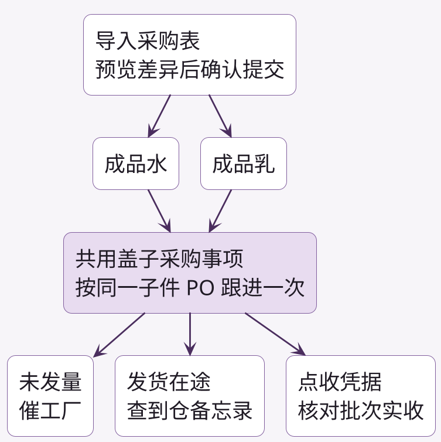
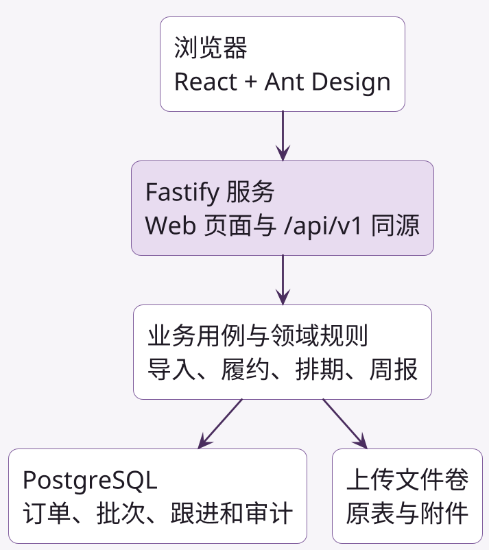

# README 配图

从仓库根目录用 PlantUML 生成两张配图。渲染环境需要有中文字体。

```sh
plantuml -charset UTF-8 -tpng -o images supply-workbench/docs/readme-diagrams.md
```

## 采购流转


```plantuml
@startuml procurement-flow
!pragma layout smetana
scale 2
skinparam defaultFontName "Heiti SC"
skinparam defaultFontSize 18
skinparam defaultFontColor #1F1A24
skinparam backgroundColor #F7F5F9
skinparam rectangleBackgroundColor #FFFFFF
skinparam rectangleBorderColor #805D9D
skinparam roundCorner 14
skinparam shadowing false
skinparam ArrowColor #4A2D5E
skinparam ArrowThickness 1.4

rectangle "导入采购表\n预览差异后确认提交" as Import
rectangle "成品水" as FinishedA
rectangle "成品乳" as FinishedB
rectangle "共用盖子采购事项\n按同一子件 PO 跟进一次" as Component #E8DCF0
rectangle "未发量\n催工厂" as Chase
rectangle "发货在途\n查到仓备忘录" as Transit
rectangle "点收凭据\n核对批次实收" as Receipt

Import -down-> FinishedA
Import -down-> FinishedB
FinishedA -down-> Component
FinishedB -down-> Component
Component -down-> Chase
Component -down-> Transit
Component -down-> Receipt
@enduml
```

## 运行架构


```plantuml
@startuml workbench-architecture
!pragma layout smetana
scale 2
skinparam defaultFontName "Heiti SC"
skinparam defaultFontSize 18
skinparam defaultFontColor #1F1A24
skinparam backgroundColor #F7F5F9
skinparam rectangleBackgroundColor #FFFFFF
skinparam rectangleBorderColor #805D9D
skinparam roundCorner 14
skinparam shadowing false
skinparam ArrowColor #4A2D5E
skinparam ArrowThickness 1.4

rectangle "浏览器\nReact + Ant Design" as Browser
rectangle "Fastify 服务\nWeb 页面与 /api/v1 同源" as Server #E8DCF0
rectangle "业务用例与领域规则\n导入、履约、排期、周报" as Work
rectangle "PostgreSQL\n订单、批次、跟进和审计" as DB
rectangle "上传文件卷\n原表与附件" as Volume

Browser -down-> Server
Server -down-> Work
Work -down-> DB
Work -down-> Volume
@enduml
```
